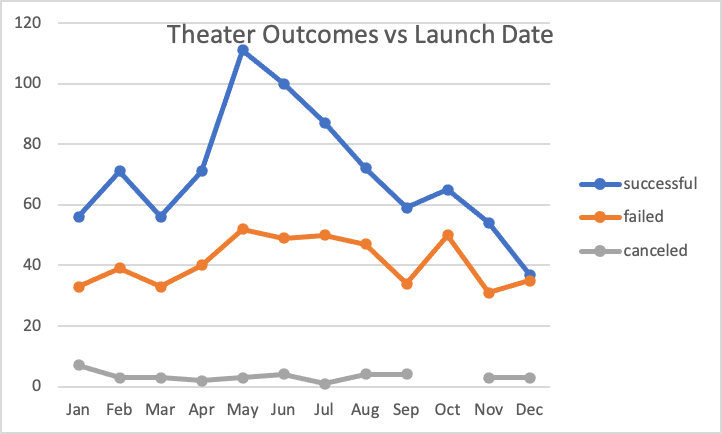
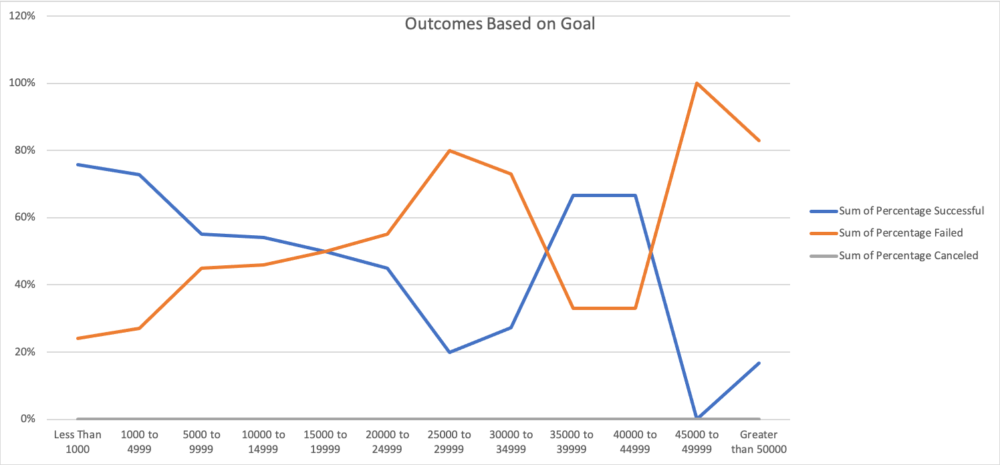

# Kickstarting with Excel

## Overview of Project

### Purpose
Using Excel, we analyzed the data from different Kickstarter campaigns to understand how those campaigns fared in relation to their launch dates and funding goals. Using the same data we created two charts: An Outcomes based on launch date chart, and an Outcomes based on goals chart. This vizualization allows the viewer to better understand the relationship between the two and their outcomes.

## Analysis and Challenges

### Analysis of Outcomes Based on Launch Date
Creating the PivotTable and PivotChart for the Outcomes Based on Launch Date was fairly simple. Most of the data used to create the table was readily available from the beginning. Following the [Excel documentation](https://support.microsoft.com/en-us/office/group-or-ungroup-data-in-a-pivottable-c9d1ddd0-6580-47d1-82bc-c84a5a340725?ui=en-us&rs=en-us&ad=us) for grouping the "Row Labels" made it easy to group the dates to allow only to display the months of the year. Perhaps the only challenge when creating the PivotChart to match with the desired chart was understanding how to filter the PivotTable to obtain the accurate information. The following PivotChart shows our findings for the Outcomes Based on Launch Date:

### Analysis of Outcomes Based on Goals
Using the COUNTIFS(), SUM(), and ROUND() Excel functions were essential in finding our analysis for the Outcomes Based on Goals. We initially created a new sheet named OutcomesBasedOnGoals in which we placed our data for obtaing the number of Successful, Failed, Canceled, and Total number of campaigns within a specific range of goals from our Kickstarter sheet. We then found their respective percentages from the total number of project from each range. Interestingly, we found that the number of canceled plays for all ranges was zero. Following the [Excel documentation](https://support.microsoft.com/en-us/office/countifs-function-dda3dc6e-f74e-4aee-88bc-aa8c2a866842?ui=en-us&rs=en-us&ad=us) for using the COUNTIFS() function helped in obtaining the total number count of successful and failed campaigns for each range. After carefully organizing our PivotTable using the numbers obtained in out OutcomesBasedOnGoals sheet, we produced the following PivotChart:

### Challenges and Difficulties Encountered
Though most of the challenge was pretty straight forward, I did find some difficulties in allocating the right fields in their appropriate rows, columns, and values, specifically in the outcomes based on goals PivotTable. Though my graph was very similar to the one provided as example in the module, it was not the same. I realized that it was the search criteria that I was using for the COUNTIFS() function that was causing my discrepancy. After adjusting my criteria a couple of times I was able to obtain the correct graph.

## Results

### Outcomes based on Launch Date
After analyzing the Outcomes based on Launch Date, we can conlude that the outcome of crowdfunding campaigns during the months of May and June have a higher success rate than campaigns launched during the months of December. We also see that very few theater campaigns are canceled throughout the entire year. 

### Outcomes based on Goals?
Based on our results from the Outcomes based on Goals data, we can conclude that goals that are much lower, tend to have a higher success rate than those that are higher. Inversly, goals that are much higher tend to have higher failure rate than those that are lower

### Limitations 
Though our challenge was to help Louise find data to help her start her own campaign for a theater play and we came very close to accomplishing that goal, there are still some data points in the dataset that may skew our results as some campaigns under the "plays" subcategory are actually campaings to develop entire theaters. If we were able to further filter our data to remove such campaigns from out data, we may be able to have a better accuracy in our findings.

### Other possible tables and/or graphs that we could create
In order to help Louise succeed in her crowdfunding campaign, we could create a table in which we can see in which country theatrical campaigns have the most success.  
